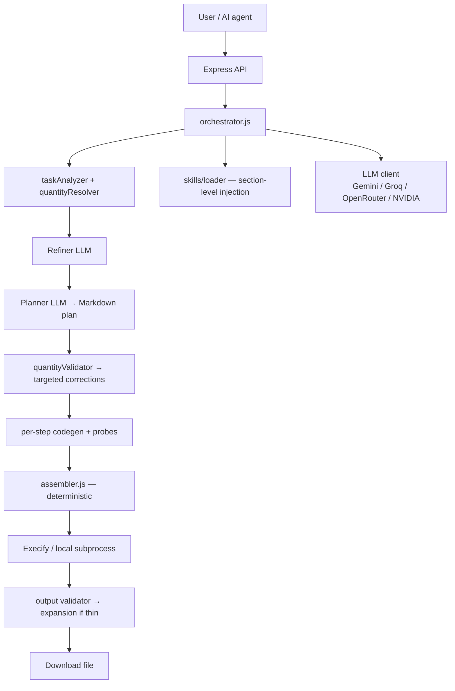

# CodeWeaver

AI orchestration layer that turns plain-language requests into real files (Word, Excel, PDF, CSV, charts, and more). Built to sit behind an **AI agent or chat UI** — not a code editor.

**CodeWeaver** = plans, generates code in chunks with hard quantity targets, runs it, validates output, expands thin content automatically, and delivers the file.  
**Execify** = sandboxed execution (optional; local tests run without it).

---

## Architecture



---

## What it can do today

| Capability | Status | Notes |
|------------|--------|--------|
| Quantity resolution | ✅ | "10-page" → `total_words: 2500, sections: 8` — injected at every stage |
| Prompt refinement | ✅ | `buildRefinerPrompt()` → 100+ word spec, validated against vague-language patterns |
| Markdown plan with quantity targets | ✅ | Per-step `words:` / `rows:` / `points:` targets |
| Targeted plan corrections | ✅ | `quantityValidator.js` — specific fixes, not full regeneration |
| Per-step probes | ✅ | Syntax, signature, pattern, content-length before assembly |
| Targeted step fix prompts | ✅ | `buildStepFixPrompt()` — fix only the specific error |
| Deterministic assembly | ✅ | `assembler.js` — no LLM, call-chain inferred from `fnParsed` |
| Output size validation + expansion | ✅ | Thin content triggers `buildContentExpansionPrompt()` |
| Python output probes | ✅ | `probe_docx.py`, `probe_xlsx.py`, `probe_chart.py` |
| Per-job NDJSON logs | ✅ | Every LLM input/output logged to `tests/output/<jobId>.log` |
| Section-level skill injection | ✅ | `pickSkillSection()` sends only relevant `##` section per step |
| Word documents (V2) | ✅ | Extract → blueprint → per-section codegen → deterministic assembly |
| Multi-step plan + chunked codegen | ✅ | Excel, PDF, CSV, text, chart via planned pipeline |
| Domain skills in prompts | ✅ | `word-node.md`, `excel-node.md`, `excel-python.md`, `chart-python.md` |
| LLM providers | ✅ | Gemini, Groq, OpenRouter, NVIDIA + cross-provider fallback |
| API server | ✅ | `npm start` |
| Single prompt local run | ✅ | `npm test` → `tests/runPrompt.js` → `tests/output/` |
| Startup environment check | ✅ | `envCheck.js` — Python packages + LLM keys |

### Supported output types

| Type | Production (Execify) | Local real-file test |
|------|----------------------|----------------------|
| Word `.docx` | Python + `python-docx` | Node + `docx` (`word-node` skill) via `npm test` |
| Excel `.xlsx` | Python + `openpyxl` | Python `openpyxl` via `npm test` |
| Chart `.png` | Python + `matplotlib` | Python `matplotlib` via `npm test` |
| CSV `.csv` | Python `csv` | Python `csv` via `npm test` |

---

## Quick start

### 1. Install

```bash
cd codeweaver
npm install
cp .env.example .env
# Edit .env — add at least one LLM API key
```

### 2. Configure LLM

```env
LLM_PROVIDER=gemini
GEMINI_API_KEY=your_key
LLM_FALLBACK_PROVIDERS=groq,openrouter
LLM_RETRY_ATTEMPTS=3
```

Groq free tier often hits **429** / **413** on large prompts; Gemini first is more reliable.

### 3. Run a single prompt locally (no Execify required)

1. Edit `tests/prompt.js` — paste ONE prompt into the `PROMPT` constant
2. Run `npm test`

Output files are written to `tests/output/`. A per-job log file is also written
to `tests/output/<jobId>.log` for debugging.

Use `CLEAN_PROBE=0` to keep Python probe files in `tests/output/` for debugging.

Word runs use Node (`docx`). Excel/chart runs need Python packages in `venv/`.

---

## Testing guide

| Command | What it does | Output |
|---------|--------------|--------|
| `npm test` | Reads `tests/prompt.js`, auto-detects type, generates + executes locally | Files + logs in `tests/output/` |

### Test prompts for each failure mode

```javascript
// Test quantity targets (10-page Word doc)
const PROMPT = 'Write a 10-page professional report about the history of space exploration...';

// Test row count enforcement (60-row Excel)
const PROMPT = 'Create an Excel spreadsheet with 60 rows of monthly sales data for 4 regions...';

// Test data points (chart)
const PROMPT = 'Generate a line chart showing global temperature anomalies from 1980 to 2023...';

// Test refiner expansion (short/vague prompt)
const PROMPT = 'Make a Mars doc';
```

---

## Project structure

```
codeweaver/
├── src/
│   ├── server.js              # API entry
│   ├── orchestrator.js        # Main job loop with deep retry
│   ├── pipeline/
│   │   ├── planParser.js      # Markdown plan → { header, imports, steps[] }
│   │   └── assembler.js       # Deterministic imports + functions + main()
│   ├── skills/loader.js       # extractSkillSections(), pickSkillSection()
│   ├── llm/
│   │   ├── client.js
│   │   ├── prompts.js         # All prompt templates (new + legacy)
│   │   └── ...
│   ├── execify/
│   │   ├── client.js
│   │   ├── validator.js
│   │   └── probes/            # probe_docx.py, probe_xlsx.py, probe_chart.py
│   ├── validation/
│   │   ├── quantityValidator.js  # Plan quantity checks + targeted corrections
│   │   ├── stepValidator.js      # Syntax, signature, pattern, content-length
│   │   └── assemblyValidator.js  # All functions present and called
│   ├── startup/
│   │   └── envCheck.js        # Python/Node packages + LLM keys
│   ├── tasks/
│   │   ├── taskAnalyzer.js    # analyzeTask() + pre-computed quantities
│   │   ├── quantityResolver.js # "10-page" → { total_words: 2500, ... }
│   │   └── taskTypes.js
│   └── utils/
│       ├── logger.js          # Console + per-job NDJSON log
│       ├── errorClassifier.js # classifyError() + buildFixInstruction()
│       └── ...
├── skills/
│   ├── index.json
│   ├── word-node.md           # + quantity_patterns section
│   ├── excel-node.md          # + quantity_patterns section
│   ├── excel-python.md        # + quantity_patterns / bulk_data section
│   └── chart-python.md        # + quantity_patterns section
├── tests/
│   ├── prompt.js              # Single prompt input
│   ├── runPrompt.js           # Local runner
│   └── output/                # Files + per-job .log files
├── .env.example
├── README.md                  # This file — start here
└── PLAN.md                    # Technical design + roadmap
```

---

## API reference

| Method | Path | Description |
|--------|------|-------------|
| `POST` | `/generate` | Start job `{ "message": "..." }` → `{ jobId, pollUrl, downloadUrl }` |
| `GET` | `/status/:jobId` | Progress snapshot with `stage`, `pct`, `msg` |
| `GET` | `/stream/:jobId` | SSE progress events `{ jobId, stage, pct, msg, ts }` |
| `GET` | `/download/:jobId` | File when `status: done` |
| `GET` | `/health` | Server + Execify health |

### SSE progress stages

| Stage | Meaning |
|-------|---------|
| `analyzing` | Parsing user request |
| `quantities` | Calculating targets (pages, rows, data points) |
| `refined` | Prompt refined into detailed spec |
| `planning` | Building Markdown plan |
| `plan_retry` | Fixing plan issues (targeted correction) |
| `plan_warn` | Plan partially corrected, continuing |
| `codegen_imports` | Generating imports block |
| `codegen_step` | Writing code for step N |
| `assembly_fix` | Re-generating a missing function |
| `assembling` | Assembling full script |
| `executing` | Running script |
| `exec_error` | Script crashed, diagnosing |
| `validating` | Checking output file |
| `output_retry` | Output too small, expanding content |
| `done` | File ready |

---

## Environment variables

See `.env.example`.

| Variable | Purpose |
|----------|---------|
| `LLM_PROVIDER` | `gemini` \| `groq` \| `openrouter` \| `nvidia` |
| `LLM_FALLBACK_PROVIDERS` | Comma list when primary fails |
| `LLM_RETRY_ATTEMPTS` | Retries per provider (default 3) |
| `GEMINI_API_KEY` / `GROQ_API_KEY` / `OPENROUTER_API_KEY` / `NVIDIA_API_KEY` | At least one required |
| `MAX_RETRIES` | Per-step codegen retries (default 3) |
| `MAX_PLAN_RETRIES` | Max plan correction attempts (default 3) |
| `MAX_OUTPUT_RETRIES` | Max output re-expansion cycles (default 2) |
| `CW_PROMPT_FILE` | Override prompt file (default: `tests/prompt.js`) |
| `CW_OUTPUT_DIR` | Output + log directory (default: `tests/output`) |
| `CW_CODE_GEN_MAX_TOKENS` | Codegen token cap |
| `CW_PYTHON` | Python executable path |
| `CLEAN_PROBE=0` | Keep Python probe files for debugging |
| `LLM_PARALLEL_ENABLED` | Enable parallel model racing |
| `LLM_PARALLEL_MODELS` | Number of models to race |
| `LLM_PARALLEL_TIMEOUT_MS` | Race timeout per step |

---

## Debugging with per-job logs

Every `npm test` run writes a log file to `tests/output/<jobId>.log`.
Each line is a JSON object with `ts`, `stage`, and stage-specific data.

```bash
# Pretty-print a job log
cat tests/output/<jobId>.log | node -e "const r=require('readline').createInterface({input:process.stdin});r.on('line',l=>{ try{ const o=JSON.parse(l); console.log(o.ts.slice(11,19), o.stage, JSON.stringify(o).slice(0,120)); } catch{} })"
```

Useful stages to check when output is wrong:
- `quantities` — verify the targets were extracted correctly from your prompt
- `plan_accepted` — check `steps` count
- `step_error` — see what probe error fired
- `probe_result` — see actual word/row counts vs targets
- `output_retry` — see why a retry was triggered

---

## Troubleshooting

| Problem | Fix |
|---------|-----|
| Groq 429 / 413 | `LLM_PROVIDER=gemini` or lower `CW_CODE_GEN_MAX_TOKENS` |
| Output file missing | Check Python packages are installed: `pip install openpyxl matplotlib python-docx Pillow` |
| Output too short | Check `tests/output/<jobId>.log` → look at `quantities` and `probe_result` stages |
| Plan keeps failing | Check `plan_errors` in log — see exact correction messages |
| Step code rejected | Check `step_error` in log — see which probe fired and why |
| "No LLM API key" | Set at least one key in `.env` |

---

## Further reading

- **[PLAN.md](./PLAN.md)** — orchestration phases, retry decision tree, design decisions, roadmap
- **[PLAN_DEEP.md](./PLAN_DEEP.md)** — full payload map, all prompt templates, per-stage validation, Python probes
- **[skills/word-node.md](./skills/word-node.md)** — docx creation rules + quantity patterns
- **[skills/excel-node.md](./skills/excel-node.md)** — SheetJS creation rules + row-loop patterns
- **[skills/excel-python.md](./skills/excel-python.md)** — openpyxl rules + bulk data patterns
- **[skills/chart-python.md](./skills/chart-python.md)** — matplotlib rules + data point patterns

---

## npm scripts

| Script | Description |
|--------|-------------|
| `npm start` | API server |
| `npm run dev` | Server with `--watch` |
| `npm test` | Run the single prompt local runner |
