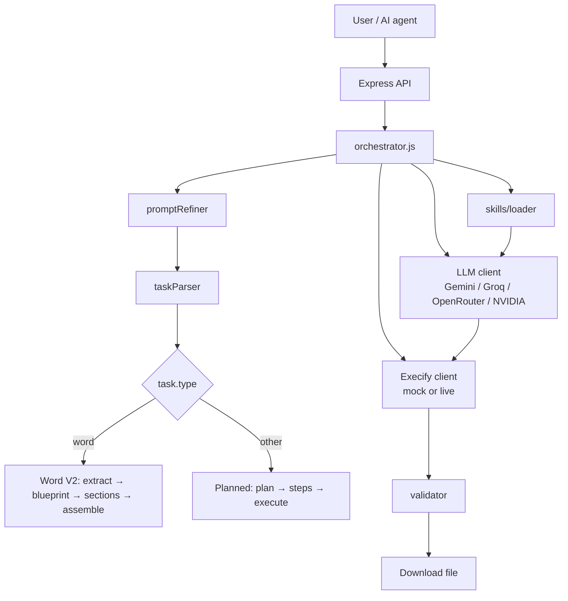

# CodeWeaver

AI orchestration layer that turns plain-language requests into real files (Word, Excel, PDF, CSV, and more). Built to sit behind an **AI agent or chat UI** — not a code editor.

**CodeWeaver** = plans, generates code in chunks, runs it, validates output, and delivers the file.  
**Execify** = sandboxed execution (optional; local tests can run without it).

---

## Architecture



## What it can do today

| Capability | Status | Notes |
|------------|--------|--------|
| Refine vague prompts (skill catalog) | ✅ | `promptRefiner.js` → detailed spec + task type hint |
| Parse natural-language requests | ✅ | `taskParser.js` → type, complexity, output file |
| Multi-step plan + chunked codegen | ✅ | Excel, PDF, CSV, text, chart via planned pipeline |
| Word documents (V2) | ✅ | Extract → blueprint → per-section codegen → deterministic assembly |
| Domain **skills** injected into prompts | ✅ | `skills/word-node.md`, `skills/excel-node.md`, `skills/excel-python.md`, `skills/chart-python.md` |
| LLM providers | ✅ | Gemini, Groq, OpenRouter, NVIDIA + cross-provider fallback |
| API server (`POST /generate`, SSE, download) | ✅ | `npm start` |
| **Single prompt local run** | ✅ | `npm test` → generates a real `.docx`, `.xlsx`, `.png`, or `.csv` based on prompt |
| Live Execify production | 🔧 | Set Execify URL + API key |

### Supported output types

| Type | Production (Execify) | Local real-file test |
|------|----------------------|----------------------|
| Word `.docx` | Python + `python-docx` | Node + `docx` (`word-node` skill) via `npm test` |
| Excel `.xlsx` | Python + `openpyxl` | Local runner (`npm test`) |
| Chart `.png` / `.jpg` | Python + `matplotlib`/`seaborn` | Local runner (`npm test`) |
| PDF, CSV, text | Python libraries | Via API + mock only today |

---

## Quick start

### 1. Install

```bash
cd codeweaver
npm install
cp .env.example .env
# Edit .env — add at least one LLM API key
```

### 2. Configure LLM (recommended)

```env
LLM_PROVIDER=gemini
GEMINI_API_KEY=your_key
LLM_FALLBACK_PROVIDERS=groq,openrouter
LLM_RETRY_ATTEMPTS=3
```

Groq free tier often hits **429** / **413** on large prompts; Gemini first is more reliable for the local runner.

For slower providers, local runner step generation can run a controlled parallel race across top models:

```env
LLM_PARALLEL_ENABLED=1
LLM_PARALLEL_MODELS=3
LLM_PARALLEL_TIMEOUT_MS=35000
LLM_PARALLEL_SCOPE=all
```

`LLM_PARALLEL_SCOPE=all` races models across all configured providers in your chain (`LLM_PROVIDER` + `LLM_FALLBACK_PROVIDERS`). Use `provider` to keep the race inside only the primary provider.

### 3. Run a single prompt locally (no Execify required)

1) Edit the prompt in [tests/prompt.py](tests/prompt.py) (paste ONE prompt into `PROMPT`)

2) Run:

```bash
npm test
```

Output files are written to [tests/output](tests/output).

Word runs use Node (`docx` from `npm install`). Excel/chart runs need Python packages in `venv` (e.g. `openpyxl`, `matplotlib`).

---

## Testing guide

| Command | What it does | Output |
|---------|--------------|--------|
| `npm test` | Reads [tests/prompt.py](tests/prompt.py), auto-detects type, generates + executes locally | Files in [tests/output](tests/output) |

---

## Project structure

```
codeweaver/
├── src/
│   ├── server.js              # API entry
│   ├── orchestrator.js        # Main job loop
│   ├── skills/loader.js       # Skill selection + prompt injection
│   ├── llm/                   # client, gemini, groq, openrouter, nvidia, prompts.js
│   ├── execify/               # client + validator
│   ├── content/               # Word V2 extract + blueprint
│   └── tasks/                 # taskTypes, taskParser
├── skills/                    # Domain knowledge for prompts
├── tests/
│   ├── prompt.py              # Single prompt input
│   └── runPrompt.js           # Local runner
├── .env.example
├── README.md                  # This file — start here
└── PLAN.md                    # Technical design + roadmap
```

---

## API reference

| Method | Path | Description |
|--------|------|-------------|
| `POST` | `/generate` | Start job `{ "message": "..." }` → `{ jobId, pollUrl, downloadUrl }` |
| `GET` | `/status/:jobId` | Progress snapshot |
| `GET` | `/stream/:jobId` | SSE progress |
| `GET` | `/download/:jobId` | File when `status: done` |
| `GET` | `/health` | Server + Execify health |

---

## Environment variables

See `.env.example`. Most important:

| Variable | Purpose |
|----------|---------|
| `LLM_PROVIDER` | `gemini` \| `groq` \| `openrouter` \| `nvidia` |
| `LLM_FALLBACK_PROVIDERS` | Comma list when primary fails (429, etc.) |
| `LLM_RETRY_ATTEMPTS` | Retries per provider (default 3) |
| `GEMINI_API_KEY` / `GROQ_API_KEY` / `OPENROUTER_API_KEY` / `NVIDIA_API_KEY` | At least one required |
| `MAX_RETRIES` | Per-step codegen retries in local runner |
| `CW_PROMPT_FILE` | Override prompt file path (default: [tests/prompt.py](tests/prompt.py)) |
| `CW_OUTPUT_DIR` | Output folder for local runner (default: [tests/output](tests/output)) |
| `CW_CODE_GEN_MAX_TOKENS` | Codegen token cap for local runner |
| `CW_PYTHON` | Python executable path for local runner |

---

## Troubleshooting

| Problem | Fix |
|---------|-----|
| Groq 429 / 413 | `LLM_PROVIDER=gemini` or lower `CW_CODE_GEN_MAX_TOKENS` |
| Output file missing | Ensure Python dependencies are installed for the requested type |
| Output file too small | Increase prompt detail or retry with a different provider |

---

## Further reading

- **[PLAN.md](./PLAN.md)** — orchestration phases, LLM strategy, mock vs live Execify, roadmap, design decisions  
- **[skills/word-node.md](./skills/word-node.md)** — docx creation rules  
- **[skills/excel-node.md](./skills/excel-node.md)** — SheetJS creation rules  

---

## npm scripts

| Script | Description |
|--------|-------------|
| `npm start` | API server |
| `npm run dev` | Server with `--watch` |
| `npm test` | Run the single prompt local runner |
