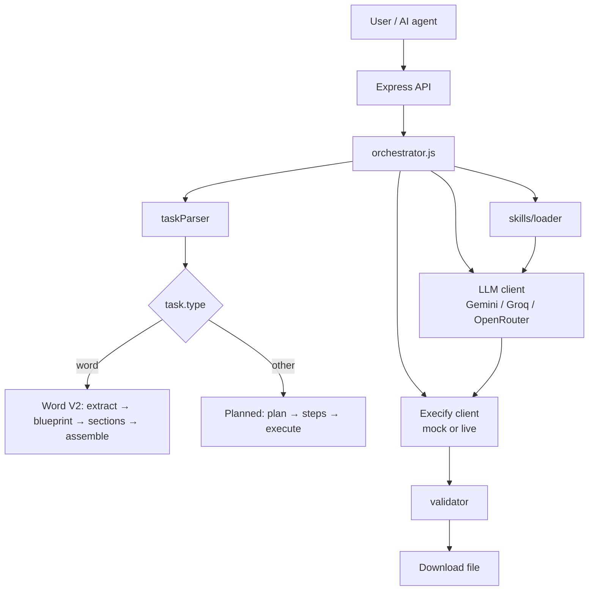

# CodeWeaver

AI orchestration layer that turns plain-language requests into real files (Word, Excel, PDF, CSV, and more). Built to sit behind an **AI agent or chat UI** — not a code editor.

**CodeWeaver** = plans, generates code in chunks, runs it, validates output, and delivers the file.  
**Execify** = sandboxed execution (optional; local tests can run without it).

---

## Architecture



## What it can do today

| Capability | Status | Notes |
|------------|--------|--------|
| Parse natural-language requests | ✅ | `taskParser.js` → type, complexity, output file |
| Multi-step plan + chunked codegen | ✅ | Excel, PDF, CSV, text, chart via planned pipeline |
| Word documents (V2) | ✅ | Extract → blueprint → per-section codegen → deterministic assembly |
| Domain **skills** injected into prompts | ✅ | `skills/word-node.md`, `skills/excel-node.md` |
| LLM providers | ✅ | Gemini, Groq, OpenRouter + cross-provider fallback |
| API server (`POST /generate`, SSE, download) | ✅ | `npm start` |
| **Real local Word test** | ✅ | `npm run test:doc` → actual `.docx` |
| **Real local Excel test** | ✅ | `npm run test:excel` → actual `.xlsx` with formulas |
| Mock Execify integration test | ✅ | `npm test` — orchestration only, **fake** file bytes |
| Live Execify production | 🔧 | Set `MOCK_EXECIFY=false` + Execify URL |

### Supported output types

| Type | Production (Execify) | Local real-file test |
|------|----------------------|----------------------|
| Word `.docx` | Python + `python-docx` | Node + `docx` (`test:doc`) |
| Excel `.xlsx` | Python + `openpyxl` | Node + `xlsx` / SheetJS (`test:excel`) |
| PDF, CSV, text, chart | Python libraries | Via API + mock only today |

---

## Quick start

### 1. Install

```bash
cd codeweaver
npm install
cp .env.example .env
# Edit .env — add at least one LLM API key
```

### 2. Configure LLM (recommended)

```env
LLM_PROVIDER=gemini
GEMINI_API_KEY=your_key
LLM_FALLBACK_PROVIDERS=groq,openrouter
LLM_RETRY_ATTEMPTS=3
```

Groq free tier often hits **429** / **413** on large prompts; Gemini first is more reliable for `test:doc` / `test:excel`.

### 3. Run real file tests (no Execify required)

**Word** — output in `tests/output/`:

```bash
npm run test:doc              # TechCorp Q3 report (default)
npm run test:doc:brief        # Nova Smart Hub launch brief
# Then open the .docx (or run if harness didn't auto-finish):
node tests/output/final_generate.js
```

**Excel** — output in `tests/output/excel/`:

```bash
npm run test:excel
# Creates tests/output/excel/sales_analytics_q3.xlsx automatically when all steps pass
```

### 4. Run API server (orchestration + mock Execify)

```bash
npm start
# Health: http://localhost:4000/health
```

```bash
curl -X POST http://localhost:4000/generate \
  -H "Content-Type: application/json" \
  -d '{"message": "Create an Excel sales report with regional totals"}'
```

Poll `GET /status/:jobId`, then `GET /download/:jobId`.

With `MOCK_EXECIFY=true` (default in `.env.example`), downloads are **placeholder files**, not real spreadsheets. Use **`test:excel`** / **`test:doc`** for real output locally.

---

## Testing guide

| Command | What it tests | Real file? | Output location |
|---------|---------------|------------|-----------------|
| `npm run test:doc` | Word generation + skills + helpers | **Yes** `.docx` | `tests/output/` |
| `npm run test:doc:brief` | Alternate Word scenario | **Yes** | `tests/output/` |
| `npm run test:excel` | Excel analytics + formulas | **Yes** `.xlsx` | `tests/output/excel/` |
| `npm test` | Full orchestrator loop | **No** (mock bytes) | N/A |

### Word test scenarios (`DOC_TEST_SCENARIO`)

| Scenario | Command | Output file |
|----------|---------|-------------|
| `techcorp` (default) | `npm run test:doc` | `techcorp_q3_report.docx` |
| `product-brief` | `npm run test:doc:brief` | `nova_smart_hub_launch.docx` |

Scenarios: `tests/docScenarios.js`

### Excel test scenario (`EXCEL_TEST_SCENARIO`)

| Scenario | Sheets | Features exercised |
|----------|--------|-------------------|
| `sales` (default) | 4 | 25+ transaction rows, revenue formulas (`E*F`), product margin %, regional `SUMIF`, analysis dashboard with cross-sheet `SUM`/`AVERAGE` |

Scenarios: `tests/excelScenarios.js`

### What is hardcoded vs LLM in local tests?

| Step | Word (`test:doc`) | Excel (`test:excel`) |
|------|-------------------|----------------------|
| Setup helpers | Fixed template | Fixed template (`setupExcel`) |
| Middle steps | **LLM** (content) | **LLM** (data + formula specs) |
| Final save | Fixed template (`OUTPUT_PATH`) | Fixed template (`XLSX.writeFile`) |

Skills teach the LLM; templates enforce paths, helpers, and formatting rules the model often gets wrong.

---

## Skills system

Skills are markdown references injected automatically into LLM prompts.

```
skills/
  index.json          # matcher: task type + language + library
  word-node.md        # docx npm — creation, tables, spacing
  excel-node.md       # SheetJS — sheets, formulas, /workspace paths
```

Loader: `src/skills/loader.js` — picks skill by `task.type`, `language`, `library`, and phase (`plan`, `codegen`, `retry`, etc.).

Disable: `SKILLS_ENABLED=0`

Runtime hints for local harnesses: `docTest`, `excelTest` (e.g. use `OUTPUT_PATH`, not `/workspace/`).

---


### Word V2 pipeline (production path)

1. **Extract** content JSON from user message  
2. **Blueprint** — flat section list (deterministic)  
3. **One LLM call per section** — narrow prompts + `word-node` skill  
4. **Deterministic assembly** — orchestrator builds final script  
5. **Execify run** + structural DOCX validation + targeted section retry  

### Excel / other types (planned pipeline)

1. Parse task → planner JSON  
2. Per-step codegen + Execify session  
3. Retries with error context (+ `buildValidationFixPrompt` on validation failures)  
4. Final step writes `/workspace/<outputFile>`  

---

## Project structure

```
codeweaver/
├── src/
│   ├── server.js              # API entry
│   ├── orchestrator.js        # Main job loop
│   ├── skills/loader.js       # Skill selection + prompt injection
│   ├── llm/                   # client, gemini, groq, openrouter, prompts.js
│   ├── execify/               # client + validator
│   ├── content/               # Word V2 extract + blueprint
│   └── tasks/                 # taskTypes, taskParser
├── skills/                    # Domain knowledge for prompts
├── tests/
│   ├── docTest.js             # Real Word test
│   ├── docScenarios.js
│   ├── docSetupTemplate.js    # Fixed docx helpers + assemble
│   ├── excelTest.js           # Real Excel test
│   ├── excelScenarios.js
│   ├── excelSetupTemplate.js  # Fixed xlsx helpers + formulas + assemble
│   ├── docSkillAudit.js
│   ├── run.js                 # Mock orchestrator smoke test
│   └── mock/execifyMock.js
├── .env.example
├── README.md                  # This file — start here
└── PLAN.md                    # Technical design + roadmap
```

---

## API reference

| Method | Path | Description |
|--------|------|-------------|
| `POST` | `/generate` | Start job `{ "message": "..." }` → `{ jobId, pollUrl, downloadUrl }` |
| `GET` | `/status/:jobId` | Progress snapshot |
| `GET` | `/stream/:jobId` | SSE progress |
| `GET` | `/download/:jobId` | File when `status: done` |
| `GET` | `/health` | Server + Execify health |

---

## Environment variables

See `.env.example`. Most important:

| Variable | Purpose |
|----------|---------|
| `LLM_PROVIDER` | `gemini` \| `groq` \| `openrouter` |
| `LLM_FALLBACK_PROVIDERS` | Comma list when primary fails (429, etc.) |
| `LLM_RETRY_ATTEMPTS` | Retries per provider (default 3) |
| `GEMINI_API_KEY` / `GROQ_API_KEY` / `OPENROUTER_API_KEY` | At least one required |
| `MOCK_EXECIFY` | `true` = fake execution (default for dev) |
| `MAX_RETRIES` | Per-step codegen retries in orchestrator |
| `DOC_TEST_SCENARIO` | `techcorp` \| `product-brief` |
| `EXCEL_TEST_SCENARIO` | `sales` |
| `SKILLS_ENABLED` | `0` to disable skill injection |
| `DOC_TEST_DETERMINISTIC_PLAN` | `1` = skip LLM planner in doc test |
| `DOC_TEST_PARALLEL_LIMIT` | `1`–`4` middle steps in parallel (doc) |

---

## Troubleshooting

| Problem | Fix |
|---------|-----|
| Groq 429 / 413 | `LLM_PROVIDER=gemini` or lower `DOC_TEST_SKILL_MAX_CHARS` / `EXCEL_TEST_SKILL_MAX_CHARS` |
| No Excel file after `test:excel` | Check `tests/output/excel/` not `tests/output/`; re-run until all steps pass |
| Word heading validation fails | Ensure `helpers.createHeading("Exact Title", 1)` is first in section array |
| Excel “need N data rows” | Retry will ask for more rows; or lower `minRows` in scenario |
| API download is tiny / corrupt | Expected with `MOCK_EXECIFY=true` — use local tests for real files |

---

## Further reading

- **[PLAN.md](./PLAN.md)** — orchestration phases, LLM strategy, mock vs live Execify, roadmap, design decisions  
- **[skills/word-node.md](./skills/word-node.md)** — docx creation rules  
- **[skills/excel-node.md](./skills/excel-node.md)** — SheetJS creation rules  

---

## npm scripts

| Script | Description |
|--------|-------------|
| `npm start` | API server |
| `npm run dev` | Server with `--watch` |
| `npm test` | Orchestrator + mock Execify |
| `npm run test:doc` | Real Word doc test |
| `npm run test:doc:techcorp` | Word — TechCorp scenario |
| `npm run test:doc:brief` | Word — product brief scenario |
| `npm run test:excel` | Real Excel analytics workbook |
| `npm run test:excel:sales` | Excel — sales scenario |
